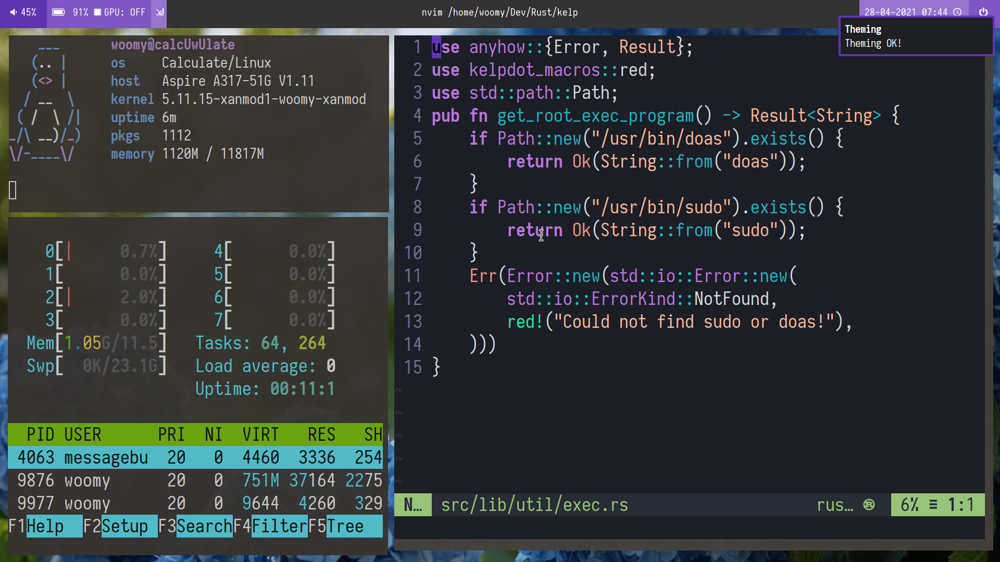

# Dotfiles-Portable
My dotfiles for Calculate Linux on my laptop
## blue

## darkblue

## darkblue-alt

## green

## grey

## lightblue

## lightgreen

## lightturquoise

## orange

## pink

## purple

## red

## turquoise

## yellow

