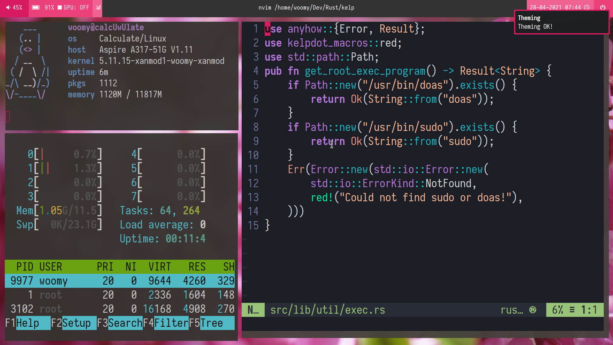
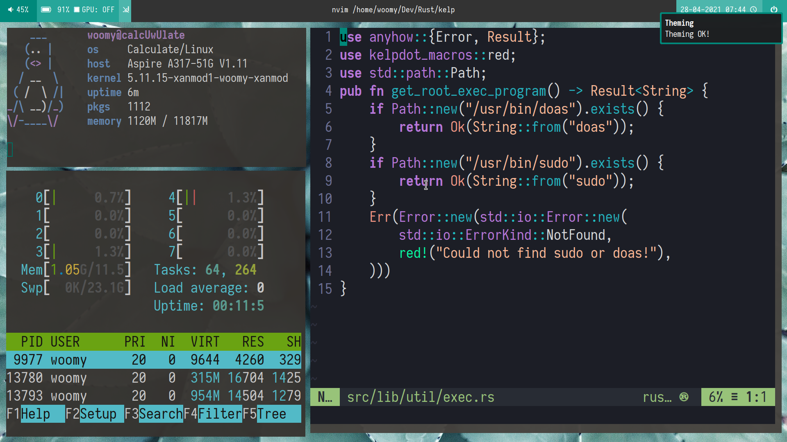

# Dotfiles-Portable

My dotfiles for Calculate Linux on my laptop

## Softwares

- [Rofi](./home/.config/rofi/config): Used as "applications" menu
- [I3](./home/.config/i3/config) Window manager
- [ZSH](./home/.zshrc) Shell
- [Visual Studio Code](./home/.config/Code/User/settings.json) Text editor
- [Neovim](./home/.config/nvim/init.vim) text editor
- [Picom](./home/.config/picom/picom.conf) Compositor
- [Alacritty](home/.config/alacritty/alacritty.yml) Terminal emulator
- [Dunst](home/.config/dunst/dunstrc) Notification daemon
- [Polybar](home/.config/polybar/launch.sh) status bar

## Blue

## Darkblue

## Darkblue-alt

## Green

## Grey

## Lightblue

## Lightgreen

## Lightturquoise

## Orange

## Pink

## Purple

## Red

## Turquoise

## Yellow

